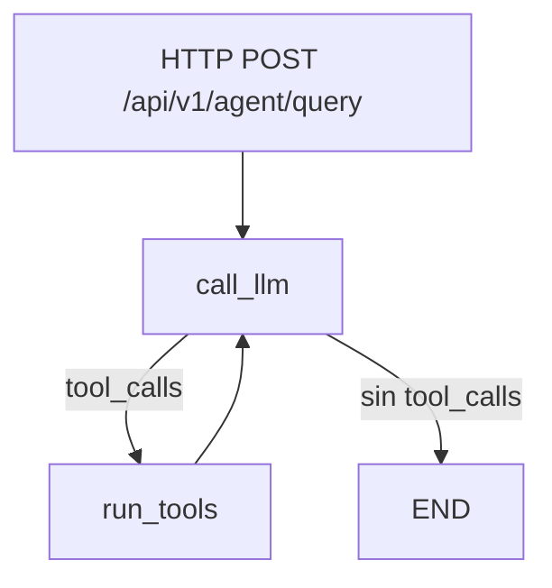

# Evidencias Lab 21 - Agentes con LangGraph (Python + FastAPI)

## Objetivo
Implementar un agente LangGraph con estado explicito, tool calling real y endpoint HTTP en FastAPI.

## Implementacion realizada
- Dependencias agregadas en `templates/fastapi/requirements.txt`:
  - `langgraph`, `langchain`, `langchain-openai`, `langchain-community`, `python-dotenv`.
- Tools del agente en `templates/fastapi/src/agent/tools.py`:
  - `get_active_users(limit=100)`.
  - `get_user_count()`.
- Grafo de estados en `templates/fastapi/src/agent/graph.py`:
  - Estado `AgentState` con `messages` y `node_trace`.
  - Nodo `call_llm`.
  - Nodo `run_tools`.
  - Arista condicional `call_llm -> run_tools | END`.
  - Loop `run_tools -> call_llm`.
  - Sanitizacion de prompt (`sanitize_prompt`) y modo `fallback` cuando faltan variables Azure OpenAI.
- Endpoint HTTP integrado en `templates/fastapi/src/app.py`:
  - `POST /api/v1/agent/query` con `AgentQueryRequest` y `AgentQueryResponse`.

## Diagrama Mermaid del grafo


## Comandos ejecutados

### 1) Dependencias y servicios
```bash
cd templates/fastapi
pip3 install -r requirements.txt

cd /workspaces/bootcamp-arquitecto-ia-cloud-native-copilot-2026
docker compose -f infra/docker-compose.data.yml up -d postgres
```

### 2) Levantar API FastAPI
```bash
cd templates/fastapi
uvicorn src.app:app --host 0.0.0.0 --port 8001
```

### 3) Probar endpoint del agente
```bash
curl -s -X POST http://localhost:8001/api/v1/agent/query \
  -H 'Content-Type: application/json' \
  -d '{"prompt":"Summarize active users with totals"}'
```

Resultado:
```json
{
  "response": "User activity report generated from real system data. Note: fallback mode active because Azure OpenAI env vars are missing.",
  "node_trace": ["call_llm", "run_tools", "call_llm"],
  "mode": "fallback"
}
```

### 4) Prueba de validacion de entrada
```bash
curl -s -X POST http://localhost:8001/api/v1/agent/query \
  -H 'Content-Type: application/json' \
  -d '{"prompt":""}'
```

Resultado:
- HTTP `422` por `string_too_short` (validacion de modelo).

## Log de nodos recorridos
Evidencia en respuesta HTTP:
```text
node_trace = ["call_llm", "run_tools", "call_llm"]
```

## Resumen de ejecuciones y validaciones

Los prompts ejecutados generaron los siguientes resultados:

**Prompt "How many active users are there?"** retornó HTTP 200 con `mode=fallback` y `node_trace=["call_llm","run_tools","call_llm"]`, confirmando que el grafo ejecuta tools reales contra la base de datos y luego vuelve al LLM para formular la respuesta.

**Prompt "Summarize active users with totals"** retornó HTTP 200 demostrando que el agente resuelve consultas agregadas manteniendo el flujo de nodos completo en el grafo.

**Prompt vacío** (`""`) retornó HTTP 422 con error `string_too_short`, validando que la API bloquea entradas inválidas antes de llegar al LLM.

## Casos de ejecución

### Caso 1 - Consulta de usuarios activos
Prompt ejecutado:
```json
{
  "prompt": "How many active users are there?"
}
```

Resultado obtenido:
```json
{
  "response": "User activity report generated from real system data. Note: fallback mode active because Azure OpenAI env vars are missing.",
  "node_trace": ["call_llm", "run_tools", "call_llm"],
  "mode": "fallback"
}
```

Significado:
- El agente interpretó la intención del prompt (resumen de actividad de usuarios).
- El grafo recorrió `call_llm -> run_tools -> call_llm`, confirmando que sí hubo tool calling.
- `mode=fallback` indica que respondió con flujo determinístico porque no hay credenciales Azure OpenAI configuradas.

### Caso 2 - Resumen con totales
Prompt ejecutado:
```json
{
  "prompt": "Summarize active users with totals"
}
```

Resultado obtenido:
- HTTP `200`.
- Respuesta con `response`, `node_trace` y `mode`.

Significado:
- El agente devolvió respuesta válida para una consulta agregada (totales), manteniendo la misma traza de nodos del flujo de herramientas.

### Caso 3 - Validación de seguridad (prompt vacío)
Prompt ejecutado:
```json
{
  "prompt": ""
}
```

Resultado obtenido:
- HTTP `422` con error `string_too_short`.

Significado:
- La API bloquea entradas inválidas antes de llegar al LLM, cumpliendo la validación de entrada requerida por el laboratorio.

## Seguridad aplicada
- Prompt con sanitizacion y limite de longitud (1000) en `sanitize_prompt`.
- Tools limitadas al scope minimo: solo conteo y listado de usuarios.
- Sin claves hardcodeadas; uso por variables de entorno para Azure OpenAI.

## Resultado obtenido
- Grafo LangGraph funcional con loop condicional.
- Tool calling con datos reales de la tabla `users`.
- Endpoint `POST /api/v1/agent/query` operativo con HTTP 200.
- Respuesta incluye trazabilidad de nodos (`node_trace`) para auditoria/evidencia.
